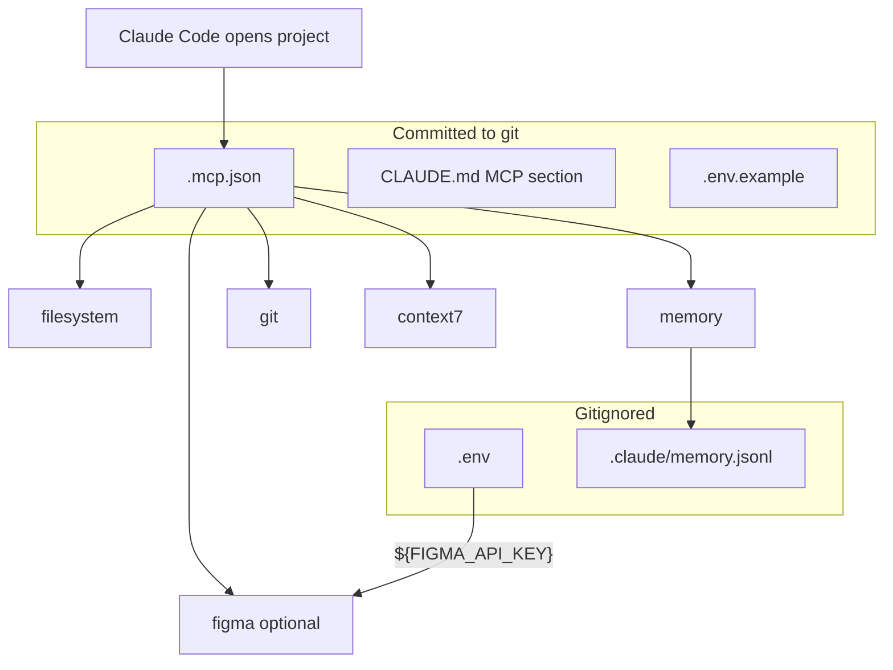

# Step 5: Set up MCP servers

**Phase 5 · AI-DLC checkpoint below**

MCP (Model Context Protocol) servers extend Claude Code with external tools — file access, persistent memory, git history, library docs via Context7, and (optionally) Figma design context. Project-scoped servers live in `.mcp.json` at the repo root. Claude Code **auto-connects** to them when you open the project — no per-developer `claude mcp add` needed.

| Layer | File | Who | When |
|-------|------|-----|------|
| Tools | `.mcp.json` | Claude Code | Auto on project open |
| Secrets | `.env` (gitignored) | MCP env expansion | Runtime |
| Memory store | `.claude/memory.jsonl` (gitignored) | memory MCP | Persistent across sessions |

**Auth rule:** secrets live in MCP/env, never in skills or commands. `.mcp.json` is committed; it contains only `${VAR}` placeholders, never literal API keys.

---

## How it fits the harness



---

## 5.0 Preflight

Run before writing `.mcp.json`:

| Check | Command | Required for |
|-------|---------|--------------|
| Node / npx | `node -v && npx -v` | filesystem, memory, context7, figma |
| uv | `uvx --version` | git MCP |
| git binary | `git --version` | git MCP |

Install gaps:

- **Node:** [nodejs.org](https://nodejs.org/) or `brew install node`
- **uv:** `curl -LsSf https://astral.sh/uv/install.sh | sh` or `brew install uv`

---

## 5.1 Baseline servers (always include)

| Server | Package | API key? | Purpose |
|--------|---------|----------|---------|
| `filesystem` | `@modelcontextprotocol/server-filesystem` | No | Sandboxed read/write scoped to project root |
| `memory` | `@modelcontextprotocol/server-memory` | No | Persistent knowledge graph across sessions |
| `git` | `mcp-server-git` via `uvx` | No | Local repo history, blame, diffs (read-only) |
| `context7` | `@upstash/context7-mcp` | No | Version-specific library/framework docs for LLMs |

Use `${CLAUDE_PROJECT_DIR:-.}` for portable paths — [Claude Code MCP docs](https://code.claude.com/docs/en/mcp).

### `.mcp.json` template

```json
{
  "mcpServers": {
    "filesystem": {
      "type": "stdio",
      "command": "npx",
      "args": ["-y", "@modelcontextprotocol/server-filesystem", "${CLAUDE_PROJECT_DIR:-.}"]
    },
    "memory": {
      "type": "stdio",
      "command": "npx",
      "args": ["-y", "@modelcontextprotocol/server-memory"],
      "env": {
        "MEMORY_FILE_PATH": "${CLAUDE_PROJECT_DIR:-.}/.claude/memory.jsonl"
      }
    },
    "git": {
      "type": "stdio",
      "command": "uvx",
      "args": ["mcp-server-git"]
    },
    "context7": {
      "type": "stdio",
      "command": "npx",
      "args": ["-y", "@upstash/context7-mcp"]
    }
  }
}
```

**Commit** `.mcp.json` — no secrets, only env placeholders. Context7 needs no API key.

---

## 5.2 Optional: Figma MCP (frontend projects)

If the project has a UI layer and uses Figma for design handoff, add the `figma` server. Skip for backend-only or CLI repos.

Append to `mcpServers`:

```json
"figma": {
  "type": "stdio",
  "command": "npx",
  "args": ["-y", "figma-developer-mcp", "--stdio"],
  "env": { "FIGMA_API_KEY": "${FIGMA_API_KEY}" }
}
```

Append to `.env.example` (only when Figma is included):

```bash
# Used by the Figma MCP server.
FIGMA_API_KEY=""
```

**`.env` workflow** *(Figma only)*:

1. Copy `.env.example` → `.env`
2. Paste your Figma personal access token into `FIGMA_API_KEY`
3. Export vars before starting Claude — Claude expands `${FIGMA_API_KEY}` from the **shell environment**, not from `.env` automatically. Options:
   - `export $(grep -v '^#' .env | xargs)` before `claude`
   - [direnv](https://direnv.net/) with `.envrc` loading `.env`
   - Set `FIGMA_API_KEY` in your shell profile

Step 3 hooks already deny `Read(./.env)` — keys stay out of the model context.

---

## 5.3 Gitignore updates

Add to `.gitignore` if missing:

```
.env
.env.*
!.env.example
.claude/memory.jsonl
```

---

## 5.4 Copilot parity — `.vscode/mcp.json`

`.mcp.json` configures MCP for Claude Code. **GitHub Copilot reads its MCP config from
`.vscode/mcp.json`** instead. Mirror the same servers so both tools have the same tools;
the schema differs in three ways:

| | `.mcp.json` (Claude) | `.vscode/mcp.json` (Copilot) |
|--|----------------------|------------------------------|
| Top-level key | `mcpServers` | `servers` |
| Secrets | `${VAR}` expanded from shell env | `inputs` block + `${input:<id>}` — VS Code **prompts** for the value and stores it securely |
| Hosted servers | stdio/npx | also supports `type: http` (e.g. Copilot's hosted GitHub server) |

```json
{
  "inputs": [
    { "type": "promptString", "id": "figma-key", "description": "Figma API Key", "password": true }
  ],
  "servers": {
    "context7": { "type": "stdio", "command": "npx", "args": ["-y", "@upstash/context7-mcp"] },
    "github":   { "type": "http", "url": "https://api.githubcopilot.com/mcp/" },
    "figma": {
      "type": "stdio",
      "command": "npx",
      "args": ["-y", "figma-developer-mcp", "--stdio"],
      "env": { "FIGMA_API_KEY": "${input:figma-key}" }
    }
  }
}
```

- Include the **same baseline servers** as `.mcp.json` (filesystem, memory, git, context7)
  unless a server is Claude-specific. The hosted **`github`** server is Copilot-native —
  add it here even though it has no `.mcp.json` counterpart.
- **Secrets:** use an `inputs` entry with `password: true` and reference it as
  `${input:<id>}` — VS Code prompts once and stores it, so no `.env` plumbing is needed on
  the Copilot side. Omit the `figma` server and its input if Figma was not opted in.
- **Commit** `.vscode/mcp.json` — it contains only input placeholders, never literal keys.

## 5.5 When to use each server

Add this section to `CLAUDE.md` (replace the one-line "MCP servers: `.mcp.json`" bullet from Step 1):

```markdown
## MCP (`.mcp.json`)
- `filesystem` — project-scoped file access via MCP tools
- `memory` — persistent knowledge graph (stored in `.claude/memory.jsonl`)
- `git` — local repo history, blame, and diffs
- `context7` — version-specific library docs (no API key)
- `figma` — *(only if frontend)* design context; key from `FIGMA_API_KEY` env

When to reach for MCP tools:
- **git** — history, blame, or "who changed this" questions before reading source
- **memory** — durable decisions or preferences that shouldn't bloat this file
- **context7** — framework/library API questions before guessing from training data (e.g. "use context7" for Next.js 15 patterns)
- **filesystem** — rare; prefer built-in Read/Write for in-repo files
- **figma** — design-to-code tasks on a Figma frame or component
```

Omit the `figma` bullet and "figma" when-to-use line if Figma was not opted in.

---

## 5.6 Verify

After writing files, start Claude Code in the repo root and run `/mcp`. All configured servers should show as connected. **For Copilot:** open the repo in VS Code — it picks up `.vscode/mcp.json` and prompts for any `inputs` on first use; check the MCP servers list in the Copilot Chat view.

| Server | Quick test prompt |
|--------|-------------------|
| `git` | "What were the last 5 commits on this branch?" |
| `memory` | "Remember that we use pnpm, not npm" — then in a new session, "What package manager do we use?" |
| `filesystem` | "List files in the project root via MCP" |
| `context7` | "Use context7 — what are the Prisma 6 migration API changes?" |
| `figma` | "Read the selected Figma frame's design context" *(requires `FIGMA_API_KEY` set)* |

If a server fails to connect, `/mcp` shows the error — usually a missing binary (`npx`, `uvx`) or unset env var.

CLI alternatives: `claude mcp list` and `claude mcp status <name>`.

---

> **AI-DLC checkpoint — Phase 5**
> Stop. Ask: **frontend project with Figma designs?** (yes → append `figma` server + `FIGMA_API_KEY` to `.env.example`; no → baseline only).
> Show draft `.mcp.json`, the parity `.vscode/mcp.json` (§5.4), `.env.example` (if Figma), gitignore additions, and `CLAUDE.md` MCP section for approval.
> After write: verify with `/mcp` (Claude) and the Copilot Chat MCP list (VS Code). Do not hardcode API keys.

**Next:** `step-6-skills.md`
