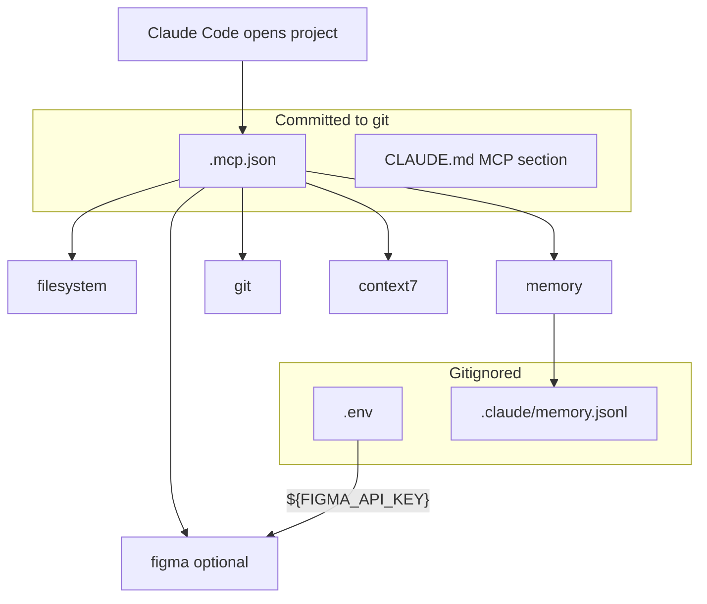

# Step 5: Set up MCP servers

**Phase 5 · AI-DLC checkpoint below**

MCP (Model Context Protocol) servers extend Claude Code with external tools — file access, persistent memory, git history, library docs via Context7, and (optionally) Figma design context. Project-scoped servers live in `.mcp.json` at the repo root. Claude Code **auto-connects** to them when you open the project — no per-developer `claude mcp add` needed.

| Layer | File | Who | When |
|-------|------|-----|------|
| Tools | `.mcp.json` | Claude Code | Auto on project open |
| Secrets | `.env` (gitignored) | MCP env expansion | Runtime |
| Memory store | `.claude/memory.jsonl` (gitignored) | memory MCP | Persistent across sessions |

**Auth rule:** secrets live in MCP/env, never in skills or commands. `.mcp.json` is committed; it contains only `${VAR}` placeholders, never literal API keys.

---

## How it fits the harness



---

## 5.0 Preflight

Run before writing `.mcp.json`:

| Check | Command | Required for |
|-------|---------|--------------|
| Node / npx | `node -v && npx -v` | filesystem, memory, context7, figma |
| uv | `uvx --version` | git MCP |
| git binary | `git --version` | git MCP |

Install gaps:

- **Node:** [nodejs.org](https://nodejs.org/) or `brew install node`
- **uv:** `curl -LsSf https://astral.sh/uv/install.sh | sh` or `brew install uv`

---

## 5.1 Baseline servers (always include)

| Server | Package | API key? | Purpose |
|--------|---------|----------|---------|
| `filesystem` | `@modelcontextprotocol/server-filesystem` | No | Sandboxed read/write scoped to project root |
| `memory` | `@modelcontextprotocol/server-memory` | No | Persistent knowledge graph across sessions |
| `git` | `mcp-server-git` via `uvx` | No | Local repo history, blame, diffs (read-only) |
| `context7` | `@upstash/context7-mcp` | No | Version-specific library/framework docs for LLMs |

> **`${CLAUDE_PROJECT_DIR:-.}` is not reliably expanded to an absolute path inside
> `args`/`env`.** Several servers (filesystem, memory, git) need a real absolute path and
> break or write to the wrong place when handed the bare `.` fallback or an unexpanded
> variable. Wrap each path-sensitive server in `sh -c` and resolve the path at launch with
> `cd "${CLAUDE_PROJECT_DIR:-.}" && pwd`. Servers that take no path (context7) stay as a
> plain `npx` invocation. Use the wrapper template below, not a bare-substitution one.

### `.mcp.json` template (`sh -c` wrapper pattern)

```json
{
  "mcpServers": {
    "filesystem": {
      "type": "stdio",
      "command": "sh",
      "args": [
        "-c",
        "d=\"$(cd \"${CLAUDE_PROJECT_DIR:-.}\" && pwd)\"; exec npx -y @modelcontextprotocol/server-filesystem \"$d/src\" \"$d/docs\""
      ]
    },
    "memory": {
      "type": "stdio",
      "command": "sh",
      "args": [
        "-c",
        "MEMORY_FILE_PATH=\"$(cd \"${1:-.}\" && pwd)/.claude/memory.jsonl\" exec npx -y @modelcontextprotocol/server-memory",
        "--",
        "${CLAUDE_PROJECT_DIR:-.}"
      ]
    },
    "git": {
      "type": "stdio",
      "command": "sh",
      "args": [
        "-c",
        "exec uvx mcp-server-git --repository \"$(cd \"${CLAUDE_PROJECT_DIR:-.}\" && pwd)\""
      ]
    },
    "context7": {
      "type": "stdio",
      "command": "npx",
      "args": ["-y", "@upstash/context7-mcp"]
    }
  }
}
```

Why each wrapper:

| Server | Wrapper does | Why the naive form fails |
|--------|--------------|--------------------------|
| `filesystem` | resolves abs path, passes **one or more roots** | bare `.` scopes the server to wherever the launcher's cwd happens to be |
| `memory` | builds an absolute `MEMORY_FILE_PATH` | a relative path lands the `.jsonl` in the wrong dir, so memory looks "empty" next session |
| `git` | passes `--repository <abs path>` | `mcp-server-git` resolves the repo from cwd otherwise |

**Scope `filesystem` to the dirs Claude should touch**, not the whole repo root — list each
root explicitly (e.g. `"$d/src" "$d/docs" "$d/e2e" "$d/scripts" "$d/static"`).

> **This is a security control, not just tidiness.** The `filesystem` MCP server exposes its
> own file-read tools (`read_text_file`, `get_file_info`, …) that **bypass the
> `Read(./.env)` permission deny** in `.claude/settings.json` — that deny only governs the
> **native** Read/Glob/Grep tools, not MCP tool namespaces. Since the server has no per-file
> exclusion, scoping it to subdirs is the *only* thing keeping root-level secrets (`.env`,
> `.git`) out of its reach: `.env` lives at the repo root, so it sits outside every allowed
> directory. The `sh -c` wrapper matters here too — if the path token doesn't expand, the
> server falls back to its cwd (**the repo root**), silently re-exposing everything. **Do not
> point the wrapper at the repo root or revert to bare `${CLAUDE_PROJECT_DIR}/src` args.** To
> grant a new area, add that specific subdirectory to the path list. Verify after restart by
> asking the model to "list the directories you have access to" — it should show the
> subdirs, not the root.

**Commit** `.mcp.json` — no secrets, only env placeholders. Context7 needs no API key.

---

## 5.2 Optional: Figma MCP (frontend projects)

If the project has a UI layer and uses Figma for design handoff, add the `figma` server. Skip for backend-only or CLI repos.

Append to `mcpServers`. Use a `sh -c` wrapper that reads **only `FIGMA_API_KEY`** from `.env`
so the key loads without a manual `export` every session:

```json
"figma": {
  "type": "stdio",
  "command": "sh",
  "args": [
    "-c",
    "f=\"${1:-.}/.env\"; [ -f \"$f\" ] && export FIGMA_API_KEY=\"$(sed -n 's/^FIGMA_API_KEY=//p' \"$f\" | tail -1)\"; exec npx -y figma-developer-mcp --stdio",
    "--",
    "${CLAUDE_PROJECT_DIR:-.}"
  ]
}
```

> **Don't rely on shell-exported env for `${FIGMA_API_KEY}`.** An `"env": { "FIGMA_API_KEY":
> "${FIGMA_API_KEY}" }` block only works if the developer remembers to `export` the key (or
> run `direnv`) **before** launching Claude — a reliable source of "figma MCP failed to
> connect" friction. The wrapper above reads the gitignored `.env` at launch, so the only
> setup step is "create `.env` with `FIGMA_API_KEY=…`". The `[ -f … ]` guard makes it a no-op
> when there is no `.env`.

> **Least privilege — extract the one key, don't source the whole `.env`.** A tempting shortcut
> is `set -a; . "$f"; set +a` (source the file, auto-export everything). **Avoid it for any
> `.env`-backed MCP server.** Sourcing exports *every* secret in `.env` — DB passwords, payment
> keys, AWS creds — into a third-party package pulled unpinned via `npx -y`, and `. .env`
> *executes* the file (a crafted `KEY=$(...)` line would run at launch). The `sed -n` form above
> reads `FIGMA_API_KEY` as **data** and exports **only** that one variable. Trade-off: it assumes
> a plain `FIGMA_API_KEY=token` line (no quote-stripping/multi-line); for a quoted secret, strip
> the quotes in `.env` or whitelist with `env -i PATH="$PATH" HOME="$HOME" NEEDED_VAR="$NEEDED_VAR" …`
> rather than reverting to a full source. Apply the same one-variable pattern to any future
> `.env`-backed server.

**`.env` setup** *(Figma only)*: document this in `.claude/skills/figma-to-code/README.md`
(created alongside the skill in Step 6 §6.7) rather than generating an `.env.example` —
cover creating a gitignored `.env` with `FIGMA_API_KEY=…`. No export/`direnv` step is needed
now that the server reads `.env` itself.

Step 3 already keeps keys out of the model context on both tools: Claude denies
`Read(./.env)` via `permissions`, and the Copilot side combines the shared
`.claude/settings.json` hook with the `.vscode/settings.json` `chat.tools.terminal.autoApprove`
deny on `.env` (Step 3 §3.4).

**Using the Figma MCP to build:** once this server is connected, the streamlined
design-to-code path is the **`figma-to-code` skill** — it pulls the frame via this server,
maps it to existing components, then builds. It's visible to Copilot Chat directly too, so
no separate prompt counterpart is needed. See Step 6 §6.7.

---

## 5.3 Gitignore updates

Add to `.gitignore` if missing:

```
.env
.env.*
.claude/memory.jsonl
```

---

## 5.4 Copilot parity — `.vscode/mcp.json`

`.mcp.json` configures MCP for Claude Code. **GitHub Copilot reads its MCP config from
`.vscode/mcp.json`** instead. Mirror the same servers so both tools have the same tools;
the schema differs in three ways:

| | `.mcp.json` (Claude) | `.vscode/mcp.json` (Copilot) |
|--|----------------------|------------------------------|
| Top-level key | `mcpServers` | `servers` |
| Secrets | `${VAR}` expanded from shell env | `inputs` block + `${input:<id>}` — VS Code **prompts** for the value and stores it securely |
| Hosted servers | stdio/npx | also supports `type: http` (e.g. Copilot's hosted GitHub server) |

```json
{
  "inputs": [
    { "type": "promptString", "id": "figma-key", "description": "Figma API Key", "password": true }
  ],
  "servers": {
    "context7": { "type": "stdio", "command": "npx", "args": ["-y", "@upstash/context7-mcp"] },
    "github":   { "type": "http", "url": "https://api.githubcopilot.com/mcp/" },
    "figma": {
      "type": "stdio",
      "command": "npx",
      "args": ["-y", "figma-developer-mcp", "--stdio"],
      "env": { "FIGMA_API_KEY": "${input:figma-key}" }
    }
  }
}
```

- Include the **same baseline servers** as `.mcp.json` (filesystem, memory, git, context7)
  unless a server is Claude-specific. The hosted **`github`** server is Copilot-native —
  add it here even though it has no `.mcp.json` counterpart.
- **Secrets:** use an `inputs` entry with `password: true` and reference it as
  `${input:<id>}` — VS Code prompts once and stores it, so no `.env` plumbing is needed on
  the Copilot side. Omit the `figma` server and its input if Figma was not opted in.
- **Commit** `.vscode/mcp.json` — it contains only input placeholders, never literal keys.

## 5.5 When to use each server

Add this section to `CLAUDE.md` (replace the one-line "MCP servers: `.mcp.json`" bullet from Step 1):

```markdown
## MCP (`.mcp.json`)
- `filesystem` — project-scoped file access via MCP tools
- `memory` — persistent knowledge graph (stored in `.claude/memory.jsonl`)
- `git` — local repo history, blame, and diffs
- `context7` — version-specific library docs (no API key)
- `figma` — *(only if frontend)* design context; key from `FIGMA_API_KEY` env

When to reach for MCP tools:
- **git** — history, blame, or "who changed this" questions before reading source
- **memory** — durable decisions or preferences that shouldn't bloat this file
- **context7** — framework/library API questions before guessing from training data (e.g. "use context7" for Next.js 15 patterns)
- **filesystem** — rare; prefer built-in Read/Write for in-repo files
- **figma** — design-to-code tasks on a Figma frame or component
```

Omit the `figma` bullet and "figma" when-to-use line if Figma was not opted in.

---

## 5.6 Verify

After writing files, start Claude Code in the repo root and run `/mcp`. All configured servers should show as connected. **For Copilot:** open the repo in VS Code — it picks up `.vscode/mcp.json` and prompts for any `inputs` on first use; check the MCP servers list in the Copilot Chat view.

| Server | Quick test prompt |
|--------|-------------------|
| `git` | "What were the last 5 commits on this branch?" |
| `memory` | "Remember that we use pnpm, not npm" — then in a new session, "What package manager do we use?" |
| `filesystem` | "List files in the project root via MCP" |
| `context7` | "Use context7 — what are the Prisma 6 migration API changes?" |
| `figma` | "Read the selected Figma frame's design context" *(requires `FIGMA_API_KEY` set)* |

If a server fails to connect, `/mcp` shows the error — usually a missing binary (`npx`, `uvx`) or unset env var.

CLI alternatives: `claude mcp list` and `claude mcp status <name>`.

---

> **AI-DLC checkpoint — Phase 5**
> Stop. **If the Phase 0 questionnaire already answered the Figma gate, apply it.** Otherwise ask: **frontend project with Figma designs?** (yes → append `figma` server + `FIGMA_API_KEY`; no → baseline only).
> Show draft `.mcp.json`, the parity `.vscode/mcp.json` (§5.4), gitignore additions, and `CLAUDE.md` MCP section for approval. If Figma is included, note that `FIGMA_API_KEY` setup is documented in `.claude/skills/figma-to-code/README.md` (Step 6 §6.7).
> After write: verify with `/mcp` (Claude) and the Copilot Chat MCP list (VS Code). Do not hardcode API keys.

**Next:** `step-6-skills.md`
